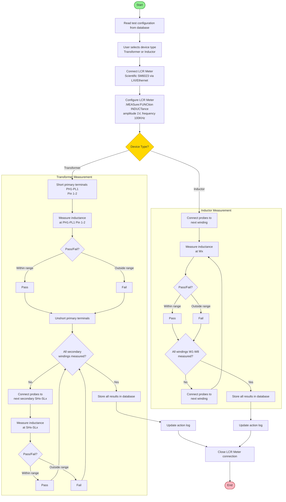

```mermaid
flowchart TD
    Start([Start]) --> A["Read test configuration from database"]

    A --> B["User selects device type\nTransformer or Inductor"]

    B --> C["Connect LCR Meter\nScientific SM6023 via LXI/Ethernet"]

    C --> D["Configure LCR Meter\n:MEASure:FUNCtion INDUCTance\namplitude 1V, frequency 100KHz"]

    D --> E{Device Type?}

    E -->|Transformer| F["Short primary terminals PH1-PL1\nPin 1-2"]
    E -->|Inductor| G["Connect probes to\nnext winding"]

    subgraph TFlow [Transformer Measurement]
        F
        F --> H["Measure inductance\nat PH1-PL1 Pin 1-2"]
        H --> I{Pass/Fail?}
        I -->|Within range| J["Pass"]
        I -->|Outside range| K["Fail"]
        J --> L["Unshort primary terminals"]
        K --> L
        L --> M{"All secondary\nwindings measured?"}
        M -->|No| N["Connect probes to\nnext secondary SHx-SLx"]
        N --> O["Measure inductance\nat SHx-SLx"]
        O --> P{Pass/Fail?}
        P -->|Within range| Q["Pass"]
        P -->|Outside range| R["Fail"]
        Q --> M
        R --> M
        M -->|Yes| S["Store all results in database"]
    end

    subgraph IFlow [Inductor Measurement]
        G
        G --> T["Measure inductance\nat Wx"]
        T --> U{Pass/Fail?}
        U -->|Within range| V["Pass"]
        U -->|Outside range| W["Fail"]
        V --> X{"All windings W1-W8\nmeasured?"}
        W --> X
        X -->|No| Y["Connect probes to\nnext winding"]
        Y --> T
        X -->|Yes| Z["Store all results in database"]
    end

    S --> AA["Update action log"]
    Z --> AB["Update action log"]
    AA --> AC["Close LCR Meter connection"]
    AB --> AC
    AC --> End([End])

    style Start fill:#90EE90,stroke:#006400
    style End fill:#FFB6C1,stroke:#8B0000
    style E fill:#FFD700,stroke:#B8860B
```
